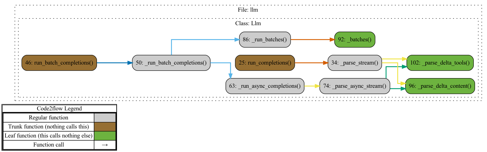
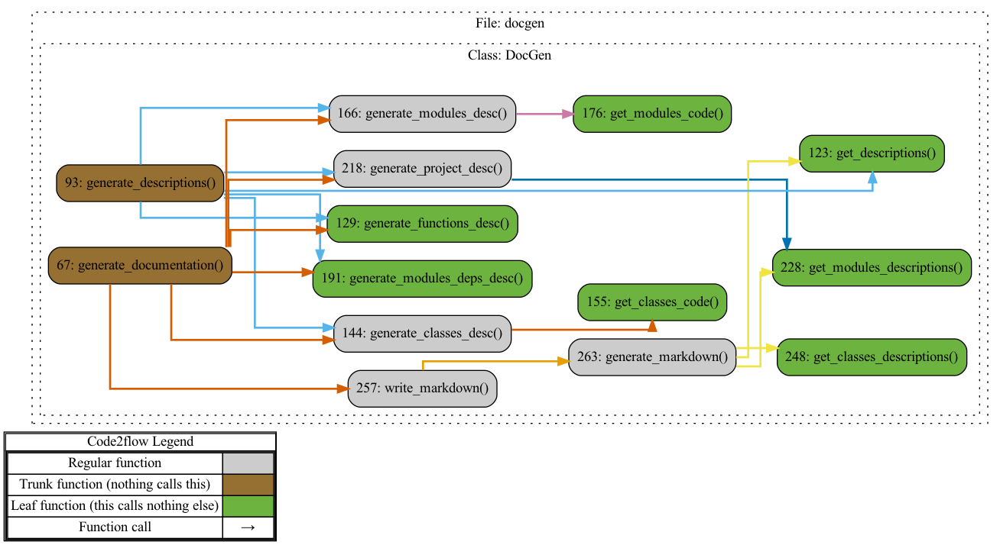
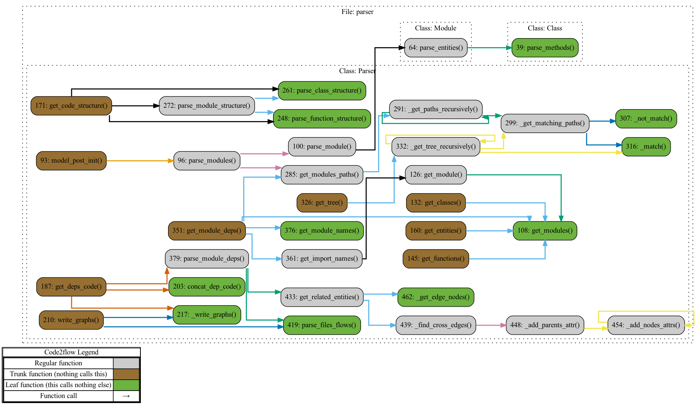
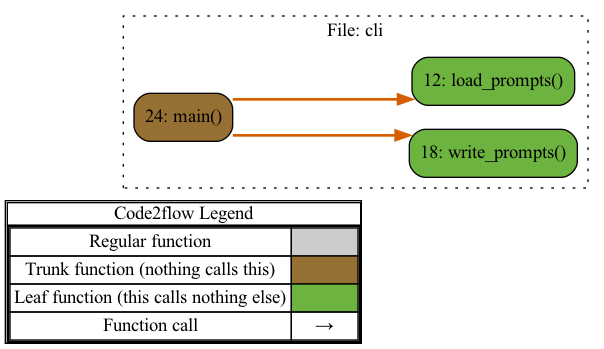
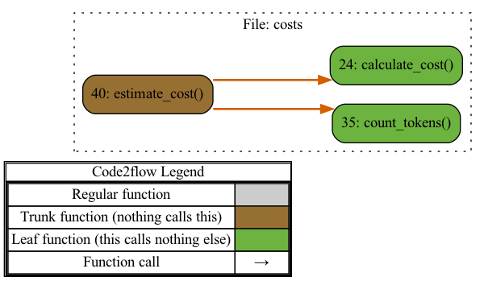
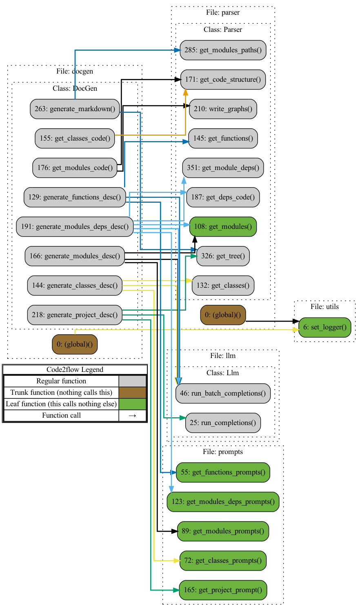
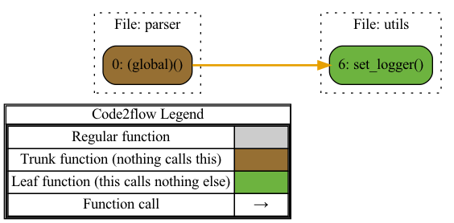
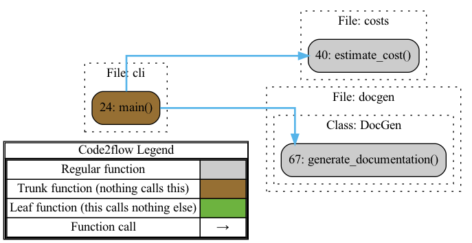

# PROJECT OVERVIEW

### Project Overview

This project is a sophisticated automation tool designed to generate comprehensive and structured documentation for Python codebases using AI-powered capabilities. Leveraging the Azure OpenAI service, it analyzes entire codebases to produce detailed descriptions, dependency mappings, execution graphs, and cost estimations, ultimately saving developers significant time and effort typically associated with manual documentation.

At the core of this system is the integration between several specialized modules, each contributing essential functionalities:

1. **Interaction with Azure OpenAI**: The `llm.py` module interfaces with Azure's OpenAI service to generate natural language completions, operating both synchronously and asynchronously. This is crucial for producing fluent and accurate descriptions and summaries for the documentation.

2. **Documentation Generation**: The `docgen.py` module orchestrates the extraction of code structures, the generation of prompt messages, and the AI-based documentation creation. This module critically integrates the parsing, prompting, and AI-response handling to build the final markdown-formatted documentation.

3. **Prompt Generation**: Via `prompts.py`, the system constructs contextually rich and relevant prompt messages to be fed into the OpenAI model. This ensures that the AI generates precise and context-aware documentation for all components of the codebase.

4. **Code Parsing and Analysis**: `parser.py` provides deep insights into the code by identifying classes, functions, and their dependencies. It generates structural and execution graphs to visualize the relationships within the codebase, enhancing the overall documentation's clarity and depth.

5. **Command-Line Interface**: The `cli.py` module allows users to interact with the system through a command-line interface, offering configurability and flexibility in how documentation is generated and what it includes. The CLI empowers users to customize their documentation generation process and to estimate associated costs.

6. **Utilities and Logging**: `utils.py` ensures robust logging functionality, using the Rich library for formatted logs and tracebacks. This enhances debugging and monitoring of the documentation process.

7. **Cost Estimation**: The `costs.py` module provides insights into the computational cost of generating documentation by estimating token usage and processing costs based on predefined pricing models.

In essence, this project amalgamates advanced parsing, AI-driven natural language processing, dynamic prompt generation, and user-friendly interaction to create an end-to-end solution for automated code documentation. Its design is modular, allowing for extensive configuration and customization, making it a valuable tool for developers aiming to maintain up-to-date and detailed documentation for their projects.

## PROJECT STRUCTURE

```
├── llm.py
├── docgen.py
├── prompts.py
├── parser.py
├── cli.py
├── utils.py
└── costs.py
```

## MODULES

**Module llm.py**:

Description:
This module provides synchronous and asynchronous interfaces to interact with an Azure OpenAI client for generating chat completions, supporting batched processing, retry mechanisms, and streaming responses.


**Module docgen.py**:

Description:
This module generates comprehensive documentation for Python projects using an OpenAI model. It creates descriptions for functions, classes, modules, their relationships, and produces execution graphs if Graphviz is installed. The generated documentation is then saved in markdown format, customizable by configuration settings.

Relations with other modules:
The `DocGen` module coordinates with the `Parser` to extract code structures, utilizes the `prompts` module to generate prompt messages, and interacts with the `Llm` module to receive AI-generated text completions. It uses `utils` for logging functionalities and orchestrates these interactions to create comprehensive documentation.


**Module prompts.py**:

Description:
This module generates prompts for documenting functions, classes, modules, and their dependencies in a large codebase, as well as providing high-level project overviews. It structures the input context and instructions to create batches of messages suitable for automated processing.


**Module parser.py**:

Description:
This module provides a comprehensive tool for parsing, analyzing, and documenting Python codebases. It identifies classes, functions, and methods within code files, generating structures and dependency graphs. It allows for extracting and exporting code structures, including the import hierarchy, and creating visual representations of code relationships.

Relations with other modules:
The module utilizes `utils.py`'s `set_logger` function to configure its logging setup, enabling enhanced logging functionality with formatted output and rich tracebacks.


**Module cli.py**:

Description:
This module generates documentation for a given codebase, optionally creates execution graphs, calculates estimation costs, and allows configuration via a prompts file. It uses Typer for command-line interaction and supports customizable options for documentation details and structure.

Relations with other modules:
The `main` function in `cli.py` initializes and configures a `DocGen` instance from `docgen.py` based on user input, then either calls `generate_documentation` to produce documentation or `estimate_cost` from `costs.py` to calculate processing costs.


**Module utils.py**:

Description:
This module configures and returns a customized logger that formats log messages with timestamps and severity levels, utilizing the Rich library for enhanced tracebacks.


**Module costs.py**:

Description:
This module estimates the cost of documenting codebases by counting the tokens in various code structures and calculating the cost using predefined model pricing, considering functions, classes, modules, and their dependencies.


## CLASSES

**class Llm [llm.py]**:

Handles synchronous and asynchronous completions using Azure OpenAI API.

**class Descriptions [docgen.py]**:

Stores structured metadata about a project’s entities, functions, and dependencies.

**class DocGen [docgen.py]**:

Generates project documentation using OpenAI model and creates execution graphs.

**class Function [parser.py]**:

Represents a function with attributes for name, path, and code.

**class Class [parser.py]**:

Represents a class with attributes and parses its methods.

**class Module [parser.py]**:

Represents a module with its path, code, and entities.

**class Parser [parser.py]**:

Parses modules, extracts code entities, and analyzes dependencies and structures.


## EXECUTION FLOWS

### MODULES











### MODULE RELATIONSHIPS






