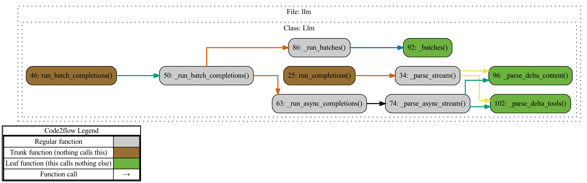
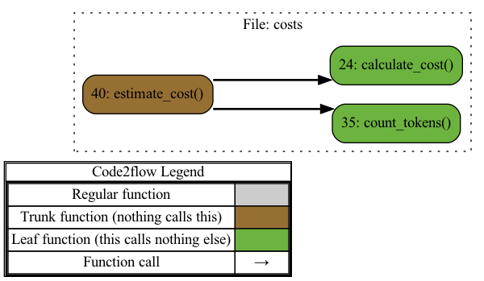

# PROJECT OVERVIEW

### Project Overview

The project at hand is a sophisticated documentation generation tool tailored for Python codebases. Its core functionality revolves around leveraging the Azure OpenAI service to create comprehensive, accurate, and structured documentation for Python projects, facilitating a deep understanding of the code's structure and relationships.

#### Key Features:

1. **Interaction with OpenAI Models**:
   - **Synchronous and Asynchronous API Calls**: The project integrates with the Azure OpenAI service to process batch messages for code completions, while also supporting streaming responses and retry mechanisms for resilience and reliability in documentation generation.

2. **Automated Documentation Generation**:
   - **Comprehensive Insights**: By parsing and analyzing Python code, the tool identifies and documents functions, classes, modules, and their interdependencies. This includes generating detailed descriptions and relationship overviews to assist developers in understanding the code at a glance.
   - **Visual Representation**: Capable of producing execution graphs and visual interactions within the codebase using Graphviz, providing a graphical representation of the code's structure.

3. **Prompt Generation**:
   - **Customizable Prompts**: The tool generates detailed prompts to extract descriptions and relationships for various code elements, organizing these prompts into message batches that can be processed further.

4. **Command-Line Interface (CLI)**:
   - **User-Friendly CLI**: It features a command-line application built with the Typer library, allowing users to customize the documentation generation process, read configuration files, and estimate the costs associated with documentation using OpenAI models.

5. **Cost Estimation**:
   - **Token Count and Pricing**: This feature estimates the cost of generating documentation by analyzing the code structure and calculating token counts in relation to predefined pricing information for the models in use.

6. **Robust Logging**:
   - **Custom Logging Configuration**: The tool employs a custom logging setup with rich tracebacks and formatted log messages to ensure transparency and ease of debugging during the documentation generation process.

Overall, this project is an all-encompassing solution for generating precise and detailed documentation of Python codebases, empowering developers to navigate and comprehend complex projects with minimal effort. By integrating state-of-the-art AI-driven text generation with robust code analysis and visualization, it ensures that documentation is both informative and accessible.

## PROJECT STRUCTURE

```
├── llm.py
├── docgen.py
├── prompts.py
├── parser.py
├── cli.py
├── utils.py
└── costs.py
```

## MODULES

**Module llm.py**:

Description:
This module provides synchronous and asynchronous methods to interact with the Azure OpenAI service, handling message batches for completions, including streaming responses and retry mechanisms for resilience.


**Module docgen.py**:

Description:
This module generates comprehensive documentation for a Python project by using an OpenAI model to create descriptions and relationship overviews for functions, classes, and modules, and optionally generates execution graphs if Graphviz is installed.

Relations with other modules:
The `DocGen` module interacts with various modules such as `parser` for extracting code structures and dependencies, `prompts` for generating input prompts, and `llm` for executing model-based completions. It also utilizes `utils` for logging configuration, ensuring smooth operation and detailed documentation generation.


**Module prompts.py**:

Description:
Provides utilities to generate documentation prompts for various code elements such as functions, classes, modules, and their dependencies, and to organize these prompts into message batches for further processing.


**Module parser.py**:

Description:
This module parses and analyzes Python source code to identify and document functions, classes, and modules. It extracts entities, handles imports, and generates detailed structural information. It also creates dependency graphs and visual representations of code interaction across multiple modules, assisting in understanding codebase relationships and execution flow.

Relations with other modules:
This module uses "set_logger" from "utils" to set up custom logging, utilizes "engine" from "code2flow" for code analysis, and leverages "BaseModel," "Field," and "PrivateAttr" from "pydantic" for data validation and model definitions. File and path manipulations are handled by "os" and "pathlib."


**Module cli.py**:

Description:
This module uses the Typer library to create a command-line application for generating code documentation. It reads configuration from a TOML prompts file, supports various options for customizing the documentation process, and can estimate the cost of using an OpenAI model for documentation.

Relations with other modules:
The main function of cli.py configures and initiates documentation generation with DocGen from docgen.py, or it estimates costs using estimate_cost from costs.py. DocGen depends on internal parsing and language modeling to generate the documentation, interacting with other modules for code analysis and text generation.


**Module utils.py**:

Description:
This module configures and returns a logger with rich tracebacks and a custom format for timestamps, log levels, and messages.


**Module costs.py**:

Description:
This module estimates the cost of generating documentation for a codebase using specific models by analyzing the code structure and calculating token counts and associated prices based on predefined model pricing information.


## CLASSES

**class Llm [llm.py]**:

Handles synchronous and asynchronous completion requests using AzureOpenAI client.

**class Descriptions [docgen.py]**:

Manages structured documentation details for various project components.

**class DocGen [docgen.py]**:

Generates comprehensive documentation for Python projects using OpenAI models.

**class Function [parser.py]**:

Represents a function's metadata and code within a codebase.

**class Class [parser.py]**:

Represents a class in the codebase, holding its methods.

**class Module [parser.py]**:

Parses and organizes code entities within a module by type.

**class Parser [parser.py]**:

Parses and extracts structured data from Python code modules.


## EXECUTION FLOWS

### MODULES






### MODULE RELATIONSHIPS


